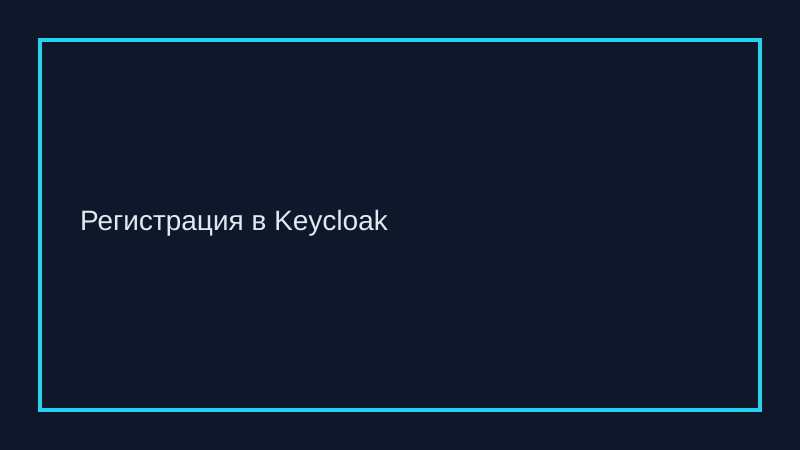
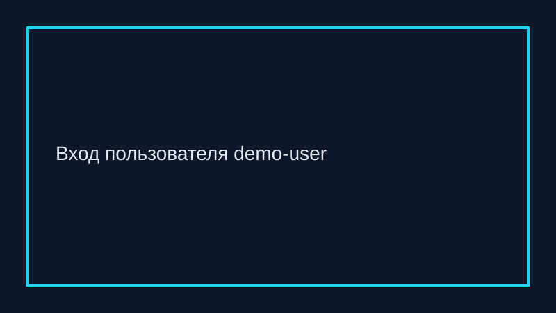
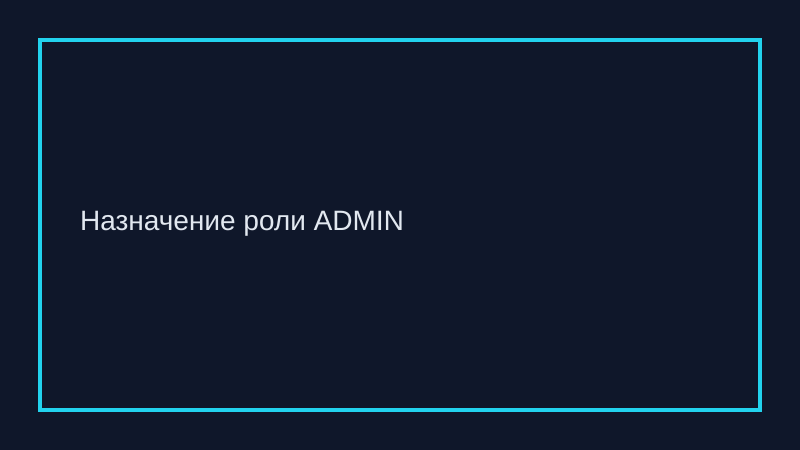

# CyberSec Shop

Учебное демо c Spring Boot, Keycloak, NGINX и mTLS. Приложение показывает:

- публичный лендинг;
- личный кабинет для роли `USER`;
- админку для роли `ADMIN`;
- интеграцию с Keycloak, CSRF + CORS, доступ только через NGINX с mTLS.

## Быстрый старт

1. Добавьте в `/etc/hosts` строки:
   ```
   127.0.0.1 example.com
   127.0.0.1 api.example.com
   ```
2. Сгенерируйте сертификаты (CA, сервер, клиент):
   ```bash
   ./scripts/generate-certs.sh
   ```
3. Поднимите стек:
   ```bash
   docker compose up --build
   ```
4. Импортированный Keycloak уже содержит пользователей `demo-user/password` (роль `USER`) и `demo-admin/password` (роли `USER`, `ADMIN`).
5. Откройте `https://example.com` в браузере, установив доверие к `certs/ca.crt` и клиентский сертификат `certs/client.p12` (пароль `password`). Без клиентского сертификата NGINX вернёт `403`.

### Переменные окружения
- `KEYCLOAK_ISSUER_URI` – адрес Keycloak (по умолчанию `https://api.example.com/realms/cybersec-shop`).
- `KEYCLOAK_CLIENT_SECRET` – секрет клиента.
- `FRONTEND_ORIGIN` – разрешённый origin для CORS (по умолчанию `https://example.com`).

### Структура проекта
- `src/main/java` – Spring Boot приложение (контроллеры и конфиг безопасности).
- `src/main/resources/templates` – страницы лендинга, кабинета и админки.
- `nginx/nginx.conf` – реверс-прокси с mTLS и логированием `ssl_client_s_dn`.
- `scripts/generate-certs.sh` – генератор CA/серверного/клиентского сертификатов.
- `keycloak/realm-export.json` – конфигурация realm с ролями и пользователями.
- `docs/images` – иллюстрации сценариев.

## Скриншоты

- Регистрация: 
- Логин: 
- Назначение роли: 

## Тесты

```bash
mvn test
```

## Пример клиентского сценария

1. Пользователь открывает `https://example.com` и видит лендинг.
2. Нажимает «Войти через Keycloak», проходит логин `demo-user/password` и попадает в личный кабинет.
3. Администратор назначает роль `ADMIN` пользователю. После повторного входа он получает доступ к `/admin`.

